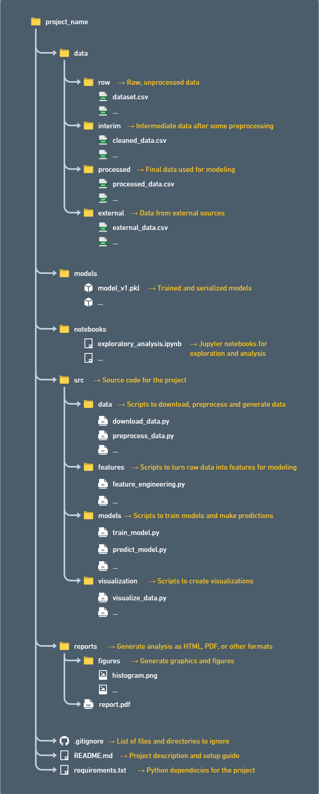

# DS-directory-structure
 A directory structure template for Data Science projects.

## Directory structure view:

Content based on a post by Brij kishore Pandey.

<a href="https://www.linkedin.com/in/brijpandeyji/" target="_blank">Brij kishore Pandey Linkedin</a>

<a href="https://www.linkedin.com/posts/brijpandeyji_datascience-machinelearning-datascience-activity-7060471648738516992-AH75?utm_source=share&utm_medium=member_desktop" target="_blank">Directory structure publishing</a>